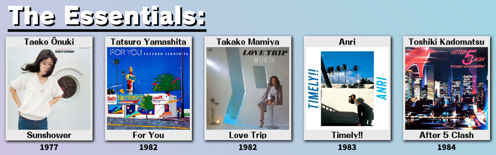
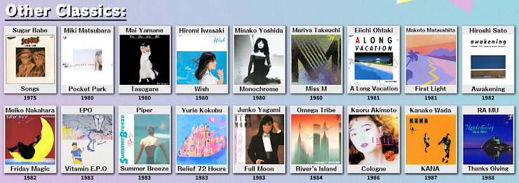
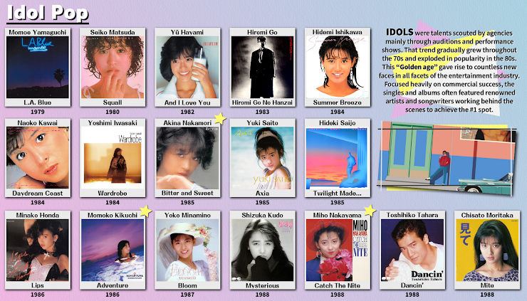
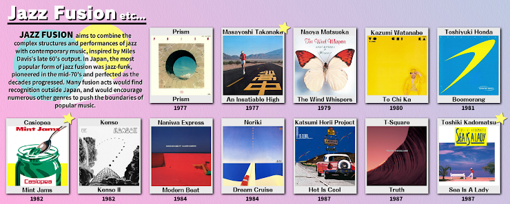
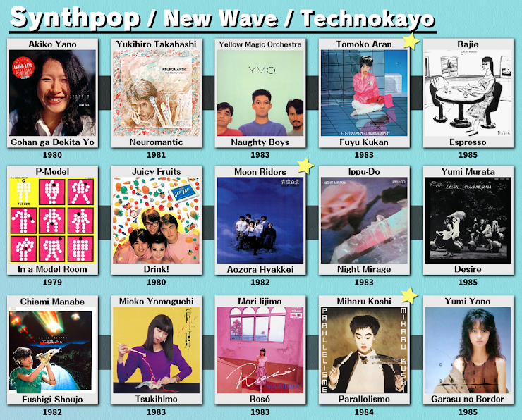
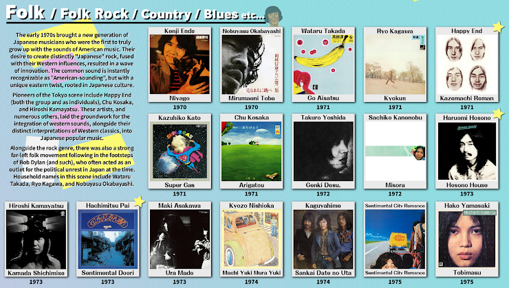
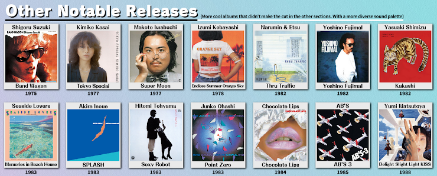

<hr style="height:2px;border-width:0;color:black;background-color:black">

```{r setup, include=FALSE}
library(tidyverse)
library(patchwork)
library(purrr)
library(broom)
library(readxl)
library(ggtext)

theme_set(theme_minimal() + theme(legend.position = "bottom"))
```

```{r import, include=FALSE}
# Read in dataset and rename variables
census = read_excel("./City Pop+ Census 2023 (Responses).xlsx") %>% 
  janitor::clean_names() %>% 
  mutate(id = row_number()) %>% 
  rename(
    age = how_old_are_you, 
    gender = what_is_your_gender_select_one_you_most_identify_with,
    locale = where_are_you_from,
    us_state = if_youre_from_the_u_s_what_state_are_you_from,
    know_years = how_many_years_have_you_known_about_city_pop,
    know_first = how_did_you_first_discover_city_pop_select_all_that_apply,
    join_years = what_year_did_you_join_city_pop,
    listen_where = what_do_you_use_to_acquire_listen_to_city_pop_music_select_all_that_apply,
    listen_format = what_are_your_preferred_formats_of_listening_to_city_pop_select_all_that_apply,
    own_amount = do_you_own_any_city_pop_music_as_physical_media_records_c_ds_tapes,
    other_communities = are_you_a_member_of_any_of_these_communities_select_all_that_apply,
    other_accounts = do_you_have_an_account_on_any_of_these_sites_select_all_that_apply,
    chart_essentials = who_is_your_favorite_artist_from_the_essentials_section_of_the_welcome_chart,
    chart_otherclassics = who_is_your_favorite_artist_from_the_other_classics_section_of_the_welcome_chart,
    chart_idolpop = who_is_your_favorite_artist_from_the_idol_pop_section_of_the_welcome_chart,
    chart_fusion = who_is_your_favorite_artist_from_the_jazz_fusion_section_of_the_welcome_chart,
    chart_synthpop = who_is_your_favorite_artist_from_the_synthpop_section_of_the_welcome_chart,
    chart_folk = who_is_your_favorite_artist_from_the_folk_section_of_the_welcome_chart,
    chart_other = who_is_your_favorite_artist_from_the_other_notable_releases_section_of_the_welcome_chart,
    fave_emote = out_of_these_server_emotes_which_is_your_favorite,
    fave_sticker = out_of_these_server_stickers_which_is_your_favorite,
    ymo = who_is_the_best_member_of_yellow_magic_orchestra_ymo,
    tats = what_is_the_relationship_status_of_tatsuro_yamashita_and_mariya_takeuchi,
    obi = what_are_your_thoughts_on_obis,
    casiopea = whats_that_one_casiopea_album_with_the_jar_and_spoon,
    blud = who_is_this_man
    ) %>% 
  mutate(
    know_first = recode(know_first, "Through samples in mainstream music" = "Through samples in mainstream music, Gone gone thank you - Tyler the creator samples Fragile by Tatsuro")
  )
```

```{r multiple_choice_sep, include=FALSE}
# Separate multiple choice questions into their own columns

# know_first
census_df_1 = census %>% 
  separate_rows(know_first, sep = ", ") %>% 
  mutate(
    know_first = ifelse(
      know_first %in% c("YouTube recommendations", "TikTok", "Heard it in a TV show/anime/movie", "Heard it in a mix", "Heard it in a meme/referenced in a meme", "Through samples in mainstream music", "Through vaporwave/future funk", "Discogs/RYM/other digging sites", "Digging in a record store", "Recommended by a friend/someone else", "Grew up listening to it"), know_first, "Other")
  ) %>% 
  count(id, know_first) %>% 
  pivot_wider(
    id_cols = id,
    names_from = know_first,
    values_from = n,
    values_fn = length,
    names_prefix = "know_first_"
  ) %>% 
  janitor::clean_names() %>% 
  left_join(census, by = 'id')

# listen/acquire from
census_df_2 = census %>% 
  separate_rows(listen_where, sep = ", ") %>% 
  count(id, listen_where) %>% 
  pivot_wider(
    id_cols = id,
    names_from = listen_where,
    values_from = n,
    values_fn = length,
    names_prefix = "listen_where_"
  ) %>% 
  janitor::clean_names() %>% 
  left_join(census_df_1, by = 'id')

# listen/acquire format
census_df_3 = census %>% 
  separate_rows(listen_format, sep = ", ") %>% 
  count(id, listen_format) %>% 
  pivot_wider(
    id_cols = id,
    names_from = listen_format,
    values_from = n,
    values_fn = length,
    names_prefix = "listen_format_"
  ) %>% 
  janitor::clean_names() %>% 
  left_join(census_df_2, by = 'id')

# other communities
census_df_4 = census %>% 
  separate_rows(other_communities, sep = ", ") %>% 
  count(id, other_communities) %>% 
  pivot_wider(
    id_cols = id,
    names_from = other_communities,
    values_from = n,
    values_fn = length,
    names_prefix = "other_communities_"
  ) %>% 
  janitor::clean_names() %>% 
  left_join(census_df_3, by = 'id')

# other sites
census_df_5 = census %>% 
  separate_rows(other_accounts, sep = ", ") %>% 
  count(id, other_accounts) %>% 
  pivot_wider(
    id_cols = id,
    names_from = other_accounts,
    values_from = n,
    values_fn = length,
    names_prefix = "other_accounts"
  ) %>% 
  janitor::clean_names() %>% 
  left_join(census_df_4, by = 'id')

census_final = census_df_5 %>% 
  relocate(id, timestamp, age, gender, locale, us_state, join_years)

```

# Demographics

## Age
```{r graph_age, cache=TRUE, echo=FALSE, warning=FALSE, message=FALSE}
graph_age = census_final %>% 
  mutate(med = median(age, na.rm = TRUE)) %>% 
  group_by(age) %>% 
  summarize(total = n()) %>%
  {. ->> b } %>% 
  subset(is.na(age)==FALSE) %>% 
  mutate(freq = total / sum(total)) %>% 
  arrange(match(age, c("13-16", "17-20", "21-24", "25-29", "30-33", ">33", NA))) %>% 
  mutate(age = factor(age, levels = age)) %>% 
  
  ggplot(aes(
    y = freq, 
    x = age, 
    fill = age, 
    label = str_wrap(paste(scales::percent(freq, accuracy = 0.1),", n = ", total, sep = ""), width = 6)
    )) + 
  geom_col(position = "dodge") +
  scale_y_continuous(labels = scales::percent, limits = c(0, 0.45)) +
  theme(legend.position = "none", plot.caption = element_markdown(hjust = 0)) +
  geom_text(aes(y = freq + 0.005),
            size = 3,
            position = position_dodge(.9),
            vjust = 0) +
  labs(
    subtitle = "City Pop+ 2023 Census",
    title = "Age groups",
    x = "Age group",
    y = "",
    caption = paste(round(b$total[is.na(b$age)==TRUE]/217*100, digits = 1), "% of total respondents or ", b$total[is.na(b$age)], " person(s) didn't answer this question.", sep = "")
    ) + 
  annotate("text", x = ">33", y = 0.3, label = "Median = 17-20")

graph_age

ggsave("./plots/1 age_group.png", width = 6, height = 4)
```

## Gender
```{r graph_gender, cache=TRUE, echo=FALSE, warning=FALSE, message=FALSE}
graph_gender = census_final %>%
  group_by(gender) %>% 
  summarize(total = n()) %>%
  {. ->> b } %>%
  subset(is.na(gender)==FALSE) %>% 
  mutate(
    freq = total / sum(total),
    gender = recode(gender, "Trans, nonbinary, and/or others" = "Trans/NB/others")
    ) %>% 
  arrange(match(gender, c("Male", "Female", "Trans/NB/others", NA))) %>% 
  mutate(gender = factor(gender, levels = gender)) %>% 
  ggplot(aes(
    y = freq, 
    x = reorder(gender, freq), 
    fill = gender, 
    label = paste(scales::percent(freq, accuracy = 0.1),", n = ", total, sep = "")
    )) + 
  geom_col(position = "dodge") +
  scale_y_continuous(labels = scales::percent, limits = c(0, 0.88)) +
  theme(legend.position = "none", plot.caption = element_markdown(hjust = 0)) +
  geom_text(aes(y = freq + 0.005),
            size = 3,
            position = position_dodge(.9),
            hjust = 0) +
  labs(
    subtitle = "City Pop+ 2023 Census",
    title = "Gender",
    x = "Gender",
    y = "",
    caption = paste(round(b$total[is.na(b$gender)==TRUE]/217*100, digits = 1), "% of total respondents or ", b$total[is.na(b$gender)], " person(s) didn't answer this question.", sep = "")
    ) + 
  coord_flip()

graph_gender

ggsave("./plots/2 gender.png", width = 6, height = 4)
```

## Region
```{r graph_locale, cache=TRUE, echo=FALSE, warning=FALSE, message=FALSE}
graph_locale = census_final %>%
  group_by(locale) %>% 
  summarize(total = n()) %>%
  {. ->> b } %>% 
  subset(is.na(locale)==FALSE) %>%
  mutate(freq = total / sum(total)) %>% 
  arrange(match(locale, c("North America", "Central America/Caribbean", "South America", "Northern Europe", "Western Europe", "Southern Europe", "Eastern Europe", "North Africa", "Sub-Saharan Africa", "West Asia/Middle East", "North/Central Asia", "South Asia", "East Asia", "Southeast Asia", "Australia/Oceania"))) %>% 
  mutate(locale = factor(locale, levels = locale)) %>% 
  ggplot(aes(
    y = freq, 
    x = reorder(locale, freq),
    fill = locale, 
    label = paste(scales::percent(freq, accuracy = 0.1),", n = ", total, sep = "")
    )) + 
  geom_col(position = "dodge") +
  scale_y_continuous(labels = scales::percent, limits = c(0, 0.65)) +
  theme(legend.position = "none", plot.caption = element_markdown(hjust = 0)) +
  geom_text(aes(y = freq + 0.002),
            size = 3,
            position = position_dodge(.9),
            hjust = 0) +
  labs(
    subtitle = "City Pop+ 2023 Census",
    title = "Origin region",
    x = "Origin region",
    y = "",
    caption = paste("0 person(s) didn't answer this question.", sep = "")
    ) +
  coord_flip()

graph_locale

ggsave("./plots/3 locale.png", width = 7, height = 9)
```


## US state
```{r graph_us_state, cache=TRUE, echo=FALSE, warning=FALSE, message=FALSE}
graph_us_state = census_final %>%
  group_by(us_state) %>% 
  summarize(total = n()) %>%
  mutate(
    freq = total / sum(total),
    us_state = ifelse(is.na(us_state), "NA", us_state)
    ) %>% 
  arrange(match(us_state, c("Alabama", "Alaska", "American Samoa", "Arizona", "Arkansas", "California", "Colorado", "Connecticut", "Delaware", "D.C.", "Florida", "Georgia", "Guam", "Hawaii", "Idaho", "Illinois", "Indiana", "Iowa", "Kansas", "Kentucky", "Louisiana", "Maine", "Maryland", "Massachusetts", "Michigan", "Minnesota", "Minor Outlying Islands", "Mississippi", "Missouri", "Montana", "Nebraska", "Nevada", "New Hampshire", "New Jersey", "New Mexico", "New York", "North Carolina", "North Dakota", "Northern Mariana Islands", "Ohio", "Oklahoma", "Oregon", "Pennsylvania", "Puerto Rico", "Rhode Island", "South Carolina", "South Dakota", "Tennessee", "Texas", "U.S. Virgin Islands", "Utah", "Vermont", "Virginia", "Washington", "West Virginia", "Wisconsin", "Wyoming"))) %>% 
  mutate(us_state = factor(us_state, levels = us_state)) %>% 
  subset(us_state != "NA") %>% 
  {. ->> b } %>% 
  ggplot(aes(
    y = freq, 
    x = reorder(us_state, freq),
    fill = us_state, 
    label = paste(scales::percent(freq, accuracy = 0.1),", n = ", total, sep = "")
    )) + 
  geom_col(position = "dodge") +
  scale_y_continuous(labels = scales::percent, limits = c(0, 0.115)) +
  theme(legend.position = "none") +
  geom_text(aes(y = freq + 0.0005),
            size = 2.5,
            position = position_dodge(.9),
            hjust = 0) +
  labs(
    subtitle = "City Pop+ 2023 Census",
    title = "Origin US state",
    x = "Origin US state",
    y = ""
    ) +
  coord_flip()

graph_us_state

ggsave("./plots/4 us_state.png", width = 8, height = 9)
```


## Year joined server
```{r graph_join_years, cache=TRUE, echo=FALSE, warning=FALSE, message=FALSE}
graph_join_years = census_final %>%
  group_by(join_years) %>% 
  summarize(total = n()) %>%
  {. ->> b } %>% 
  subset(!is.na(join_years)) %>%
  mutate(freq = total / sum(total)) %>% 
  ggplot(aes(
    y = freq, 
    x = factor(join_years),
    fill = join_years, 
    label = str_wrap(paste(scales::percent(freq, accuracy = 0.1),", n = ", total, sep = ""), width = 6)
    )) + 
  geom_col(position = "dodge") +
  scale_y_continuous(labels = scales::percent, limits = c(0, 0.40)) +
  theme(axis.text.x = 
          element_text(angle = 45, hjust = 1),
        legend.position = "none",
        plot.caption = element_markdown(hjust = 0)
        ) +
  geom_text(aes(y = freq + 0.005),
            size = 3,
            position = position_dodge(.9),
            vjust = 0) +
  labs(
    subtitle = "City Pop+ 2023 Census",
    title = "Year joined server",
    x = "Year",
    y = "",
    caption = paste(round(b$total[is.na(b$join_years)==TRUE]/217*100, digits = 1), "% of total respondents or ", b$total[is.na(b$join_years)], " person(s) didn't answer this question.", sep = "")
    )

graph_join_years

ggsave("./plots/6 join_years.png", width = 6, height = 4)
```


<hr style="height:2px;border-width:0;color:black;background-color:black">

# Interaction with City Pop

## Years known city pop
```{r graph_know_years, cache=TRUE, echo=FALSE, warning=FALSE, message=FALSE}
graph_know_years = census_final %>%
  group_by(know_years) %>% 
  summarize(total = n()) %>%
  {. ->> b } %>%
  subset(is.na(know_years)==FALSE) %>% 
  mutate(freq = total / sum(total)) %>% 
  arrange(match(know_years, c("Less than a year", "1-2", "3-4", "5-6", "7-9", "10+"))) %>% 
  mutate(know_years = factor(know_years, levels = know_years)) %>% 
  ggplot(aes(
    y = freq, 
    x = know_years,
    fill = know_years, 
    label = str_wrap(paste(scales::percent(freq, accuracy = 0.1),", n = ", total, sep = ""), width = 6)
    )) + 
  geom_col(position = "dodge") +
  scale_y_continuous(labels = scales::percent, limits = c(0, 0.47)) +
  theme(legend.position = "none", plot.caption = element_markdown(hjust = 0)) +
  geom_text(aes(y = freq + 0.005),
            size = 3,
            position = position_dodge(.9),
            vjust = 0) +
  labs(
    subtitle = "City Pop+ 2023 Census",
    title = "Years known city pop",
    x = "Years",
    y = "",
    caption = paste("0 person(s) didn't answer this question.", sep = "")
    )

graph_know_years

ggsave("./plots/5 know_years.png", width = 6, height = 4)
```

## Where discovered city pop
```{r graph_know_first, cache=TRUE, echo=FALSE, warning=FALSE, message=FALSE}
graph_know_first = census %>% 
  separate_rows(know_first, sep = ", ") %>% 
  mutate(
    know_first = ifelse(
      know_first %in% c("YouTube recommendations", "TikTok", "Heard it in a TV show/anime/movie", "Heard it in a mix", "Heard it in a meme/referenced in a meme", "Through samples in mainstream music", "Through vaporwave/future funk", "Discogs/RYM/other digging sites", "Digging in a record store", "Recommended by a friend/someone else", "Grew up listening to it"), know_first, "Other")
  ) %>% 
  count(id, know_first) %>% 
  group_by(know_first) %>% 
  summarize(total = n()) %>%
  {. ->> b } %>%
  subset(is.na(know_first)==FALSE) %>% 
  mutate(freq = total / sum(total)) %>% 
  ggplot(aes(
    y = freq, 
    x = reorder(know_first, freq),
    fill = know_first, 
    label = paste(scales::percent(freq, accuracy = 0.1),", n = ", total, sep = "")
    )) + 
  geom_col(position = "dodge") +
  scale_x_discrete(label = function(x) str_wrap(x, width = 20)) +
  scale_y_continuous(label = scales::percent, limits = c(0, 0.47)) +
  theme(legend.position = "none", plot.caption = element_markdown(hjust = 0)) +
  geom_text(aes(y = freq + 0.002),
            size = 3,
            position = position_dodge(.9),
            hjust = 0) +
  labs(
    subtitle = "City Pop+ 2023 Census",
    title = "How did you first discover city pop?",
    x = "",
    y = "",
    caption = paste("0 person(s) didn't answer this question.", sep = "")
    ) +
  coord_flip()

graph_know_first

ggsave("./plots/7 know_first.png", width = 8, height = 6)

# extract other responses

other_know_first = census %>% 
  separate_rows(know_first, sep = ", ") %>% 
  mutate(
    know_first_other = ifelse(
      know_first %in% c("YouTube recommendations", "TikTok", "Heard it in a TV show/anime/movie", "Heard it in a mix", "Heard it in a meme/referenced in a meme", "Through samples in mainstream music", "Through vaporwave/future funk", "Discogs/RYM/other digging sites", "Digging in a record store", "Recommended by a friend/someone else", "Grew up listening to it"), NA, know_first)
  ) %>% 
  subset(is.na(know_first_other)==FALSE) %>% 
  select(know_first_other) %>% 
  arrange(know_first_other) %>% 
  rename("Other responses" = know_first_other)

other_know_first %>% knitr::kable()
```

## Where one listens to city pop
```{r graph_listen_where, cache=TRUE, echo=FALSE, warning=FALSE, message=FALSE}
graph_listen_where = census %>% 
  separate_rows(listen_where, sep = ", ") %>%
  count(id, listen_where) %>% 
  group_by(listen_where) %>% 
  summarize(total = n()) %>%
  mutate(listen_where = recode(listen_where,
                          "Mix/Web radio sites (SoundCloud/Mixcloud/NTS/etc.)" = "Mix/Web radio",
                          "Physical media (vinyl records/CDs/tapes/etc.)" = "Physical media",
                          "Purchased libraries (iTunes/OTOTOY/mora/etc.)" = "Purchased digital files",
                          "Streaming services (Spotify/Apple Music/etc.)" = "Streaming services",
                          "Video sites (YouTube/Niconico/bilibili/etc.)" = "Video sites",
                          "Yarr! I sail the torrential seas to get my booty! (rutracker/JPS/RED/OPS/etc.)" = "Torr- [redacted]")) %>%
  {. ->> b } %>%
  subset(is.na(listen_where)==FALSE) %>% 
  mutate(freq = (total / sum(total))) %>% 
  ggplot(aes(
    y = freq, 
    x = reorder(listen_where, freq),
    fill = listen_where, 
    label = paste(scales::percent(freq, accuracy = 0.1),", n = ", total, sep = "")
    )) + 
  geom_col(position = "dodge") +
  scale_x_discrete(label = function(x) str_wrap(x, width = 20)) +
  scale_y_continuous(label = scales::percent, limits = c(0, 0.47)) +
  theme(legend.position = "none", plot.caption = element_markdown(hjust = 0)) +
  geom_text(aes(y = freq + 0.002),
            size = 3,
            position = position_dodge(.9),
            hjust = 0) +
  labs(
    subtitle = "City Pop+ 2023 Census",
    title = "What do you use to acquire/listen to city pop music?",
    x = "",
    y = "",
    caption = paste(round(b$total[is.na(b$listen_where)==TRUE]/217*100, digits = 1), "% of total respondents or ", b$total[is.na(b$listen_where)==TRUE], " person(s) didn't answer this question.", sep = "")
    ) +
  coord_flip()

graph_listen_where

ggsave("./plots/8 listen_where.png", width = 8, height = 6)
```

## Preferred format for listening
```{r graph_listen_format, cache=TRUE, echo=FALSE, warning=FALSE, message=FALSE}
graph_listen_format = census %>% 
  separate_rows(listen_format, sep = ", ") %>%
  count(id, listen_format) %>% 
  group_by(listen_format) %>% 
  summarize(total = n()) %>%
  {. ->> b } %>%
  subset(is.na(listen_format)==FALSE) %>% 
  mutate(freq = (total / sum(total))) %>%
  ggplot(aes(
    y = freq, 
    x = reorder(listen_format, freq),
    fill = listen_format, 
    label = paste(scales::percent(freq, accuracy = 0.1),", n = ", total, sep = "")
    )) + 
  geom_col(position = "dodge") +
  scale_x_discrete(label = function(x) str_wrap(x, width = 20)) +
  scale_y_continuous(label = scales::percent, limits = c(0, 0.47)) +
  theme(legend.position = "none", plot.caption = element_markdown(hjust = 0)) +
  geom_text(aes(y = freq + 0.002),
            size = 3,
            position = position_dodge(.9),
            hjust = 0) +
  labs(
    subtitle = "City Pop+ 2023 Census",
    title = "What are your preferred formats of listening to city pop?",
    x = "",
    y = "",
    caption = paste("0 person(s) didn't answer this question.", sep = "")
    ) +
  coord_flip()

graph_listen_format

ggsave("./plots/9 listen_format.png", width = 8, height = 6)
```

## Physical media ownership
```{r graph_own_amount, cache=TRUE, echo=FALSE, warning=FALSE, message=FALSE}
graph_own_amount = census %>% 
  group_by(own_amount) %>% 
  summarize(total = n()) %>%
  {. ->> b } %>%
  subset(is.na(own_amount)==FALSE) %>% 
  mutate(freq = (total / sum(total))
         )%>%
  ggplot(aes(
    y = freq, 
    x = reorder(own_amount, freq),
    fill = own_amount, 
    label = paste(scales::percent(freq, accuracy = 0.1),", n = ", total, sep = "")
    )) + 
  geom_col(position = "dodge") +
  scale_x_discrete(label = function(x) str_wrap(x, width = 20)) +
  scale_y_continuous(label = scales::percent, limits = c(0, 0.47)) +
  theme(legend.position = "none", plot.caption = element_markdown(hjust = 0)) +
  geom_text(aes(y = freq + 0.002),
            size = 3,
            position = position_dodge(.9),
            hjust = 0) +
  labs(
    subtitle = "City Pop+ 2023 Census",
    title = "Do you own any city pop music as physical media?",
    x = "",
    y = "",
    caption = paste("0 person(s) didn't answer this question.", sep = "")
    ) +
  coord_flip()

graph_own_amount

ggsave("./plots/10 own_amount.png", width = 8, height = 6)
```


<hr style="height:2px;border-width:0;color:black;background-color:black">

# Communities outside Discord

```{r graph_other_communities, cache=TRUE, echo=FALSE, warning=FALSE, message=FALSE}
graph_other_communities = census %>% 
  separate_rows(other_communities, sep = ", ") %>%
  count(id, other_communities) %>% 
  group_by(other_communities) %>% 
  summarize(total = n()) %>%
  mutate(freq = (total / sum(total)),
         other_communities = ifelse(is.na(other_communities)==TRUE, "None selected", other_communities)
         ) %>%
  arrange(match(other_communities, c("r/citypop", "r/citypopcirclejerk", "City Pop Facebook page(s)", "None selected"))) %>% 
  mutate(other_communities = factor(other_communities, levels = other_communities)) %>% 
  ggplot(aes(
    y = freq, 
    x = reorder(other_communities, desc(other_communities)),
    fill = other_communities, 
    label = paste(scales::percent(freq, accuracy = 0.1),", n = ", total, sep = "")
    )) + 
  geom_col(position = "dodge") +
  scale_x_discrete(label = function(x) str_wrap(x, width = 20)) +
  scale_y_continuous(label = scales::percent, limits = c(0, 0.47)) +
  theme(legend.position = "none") +
  geom_text(aes(y = freq + 0.002),
            size = 3,
            position = position_dodge(.9),
            hjust = 0) +
  labs(
    subtitle = "City Pop+ 2023 Census",
    title = "Are you a member of any of these communities?",
    x = "",
    y = ""
    ) +
  coord_flip()

graph_other_communities

ggsave("./plots/11 other_communities.png", width = 8, height = 6)
```

```{r graph_other_accounts, cache=TRUE, echo=FALSE, warning=FALSE, message=FALSE}
graph_other_accounts = census %>% 
  separate_rows(other_accounts, sep = ", ") %>%
  count(id, other_accounts) %>% 
  group_by(other_accounts) %>% 
  summarize(total = n()) %>%
  mutate(freq = (total / sum(total)),
         other_accounts = ifelse(is.na(other_accounts)==TRUE, "None selected", other_accounts)
         ) %>%
  arrange(match(other_accounts, c("last.fm", "Discogs", "RateYourMusic", "None selected"))) %>% 
  mutate(other_accounts = factor(other_accounts, levels = other_accounts)) %>% 
  ggplot(aes(
    y = freq, 
    x = reorder(other_accounts, desc(other_accounts)),
    fill = other_accounts, 
    label = paste(scales::percent(freq, accuracy = 0.1),", n = ", total, sep = "")
    )) + 
  geom_col(position = "dodge") +
  scale_x_discrete(label = function(x) str_wrap(x, width = 20)) +
  scale_y_continuous(label = scales::percent, limits = c(0, 0.47)) +
  theme(legend.position = "none") +
  geom_text(aes(y = freq + 0.002),
            size = 3,
            position = position_dodge(.9),
            hjust = 0) +
  labs(
    subtitle = "City Pop+ 2023 Census",
    title = "Do you have an account on any of these sites?",
    x = "",
    y = ""
    ) +
  coord_flip()

graph_other_accounts

ggsave("./plots/12 other_accounts.png", width = 8, height = 6)
```


<hr style="height:2px;border-width:0;color:black;background-color:black">

# Welcome Chart questions

## Essentials


```{r graph_chart_essentials, cache=TRUE, echo=FALSE, warning=FALSE, message=FALSE}
graph_chart_essentials = census %>% 
  group_by(chart_essentials) %>% 
  summarize(total = n()) %>%
  {. ->> b } %>%
  subset(is.na(chart_essentials)==FALSE) %>% 
  mutate(freq = (total / sum(total))
         ) %>% 
  ggplot(aes(
    y = freq, 
    x = reorder(chart_essentials, freq),
    fill = chart_essentials, 
    label = paste(scales::percent(freq, accuracy = 0.1),", n = ", total, sep = "")
    )) + 
  geom_col(position = "dodge", width = 0.7) +
  scale_x_discrete(label = function(x) str_wrap(x, width = 20)) +
  scale_y_continuous(label = scales::percent, limits = c(0, 0.55)) +
  theme(legend.position = "none", plot.caption = element_markdown(hjust = 0)) +
  geom_text(aes(y = freq + 0.002),
            size = 3,
            position = position_dodge(.9),
            hjust = 0) +
  labs(
    subtitle = "City Pop+ 2023 Census",
    title = "Who is your favorite artist from the \"Essentials\" section?",
    x = "",
    y = "",
    caption = paste(round(b$total[is.na(b$chart_essentials)==TRUE]/217*100, digits = 1), "% of total respondents or ", b$total[is.na(b$chart_essentials)], " person(s) didn't answer this question.", sep = "")
    ) +
  coord_flip()

graph_chart_essentials

ggsave("./plots/13 chart_essentials.png", width = 8, height = 6)
```

## Other classics


```{r graph_chart_otherclassics, cache=TRUE, echo=FALSE, warning=FALSE, message=FALSE}
graph_chart_otherclassics = census %>% 
  group_by(chart_otherclassics) %>% 
  summarize(total = n()) %>%
  {. ->> b } %>% 
  subset(is.na(chart_otherclassics)==FALSE) %>%
  mutate(freq = (total / sum(total))
         ) %>%
  ggplot(aes(
    y = freq, 
    x = reorder(chart_otherclassics, freq),
    fill = chart_otherclassics, 
    label = paste(scales::percent(freq, accuracy = 0.1),", n = ", total, sep = "")
    )) + 
  geom_col(position = "dodge") +
  scale_x_discrete(label = function(x) str_wrap(x, width = 20)) +
  scale_y_continuous(label = scales::percent, limits = c(0, 0.55)) +
  theme(legend.position = "none", plot.caption = element_markdown(hjust = 0)) +
  geom_text(aes(y = freq + 0.002),
            size = 3,
            position = position_dodge(.9),
            hjust = 0) +
  labs(
    subtitle = "City Pop+ 2023 Census",
    title = "Who is your favorite artist from the \"Other Classics\" section?",
    x = "",
    y = "",
    caption = paste(round(b$total[is.na(b$chart_otherclassics)==TRUE]/217*100, digits = 1), "% of total respondents or ", b$total[is.na(b$chart_otherclassics)], " person(s) didn't answer this question.", sep = "")
    ) +
  coord_flip()

graph_chart_otherclassics

ggsave("./plots/14 chart_otherclassics.png", width = 8, height = 6)
```

## Idol pop


```{r graph_chart_idolpop, cache=TRUE, echo=FALSE, warning=FALSE, message=FALSE}
graph_chart_idolpop = census %>% 
  group_by(chart_idolpop) %>% 
  summarize(total = n()) %>%
  {. ->> b } %>% 
  subset(is.na(chart_idolpop)==FALSE) %>%
  mutate(freq = (total / sum(total))
         ) %>%
  ggplot(aes(
    y = freq, 
    x = reorder(chart_idolpop, freq),
    fill = chart_idolpop, 
    label = paste(scales::percent(freq, accuracy = 0.1),", n = ", total, sep = "")
    )) + 
  geom_col(position = "dodge") +
  scale_x_discrete(label = function(x) str_wrap(x, width = 20)) +
  scale_y_continuous(label = scales::percent, limits = c(0, 0.55)) +
  theme(legend.position = "none", plot.caption = element_markdown(hjust = 0)) +
  geom_text(aes(y = freq + 0.002),
            size = 3,
            position = position_dodge(.9),
            hjust = 0) +
  labs(
    subtitle = "City Pop+ 2023 Census",
    title = "Who is your favorite artist from the \"Idol Pop\" section?",
    x = "",
    y = "",
    caption = paste(round(b$total[is.na(b$chart_idolpop)==TRUE]/217*100, digits = 1), "% of total respondents or ", b$total[is.na(b$chart_idolpop)], " person(s) didn't answer this question.", sep = "")
    ) +
  coord_flip()

graph_chart_idolpop

ggsave("./plots/15 chart_idolpop.png", width = 8, height = 6)
```

## Jazz fusion


```{r graph_chart_fusion, cache=TRUE, echo=FALSE, warning=FALSE, message=FALSE}
graph_chart_fusion = census %>% 
  group_by(chart_fusion) %>% 
  summarize(total = n()) %>%
  {. ->> b } %>% 
  subset(is.na(chart_fusion)==FALSE) %>%
  mutate(freq = (total / sum(total))
         ) %>%
  ggplot(aes(
    y = freq, 
    x = reorder(chart_fusion, freq),
    fill = chart_fusion, 
    label = paste(scales::percent(freq, accuracy = 0.1),", n = ", total, sep = "")
    )) + 
  geom_col(position = "dodge") +
  scale_x_discrete(label = function(x) str_wrap(x, width = 20)) +
  scale_y_continuous(label = scales::percent, limits = c(0, 0.55)) +
  theme(
    legend.position = "none", 
    plot.caption = element_markdown(hjust = 0)) +
  geom_text(aes(y = freq + 0.002),
            size = 3,
            position = position_dodge(.9),
            hjust = 0) +
  labs(
    subtitle = "City Pop+ 2023 Census",
    title = "Who is your favorite artist from the \"Jazz Fusion\" section?",
    x = "",
    y = "",
    caption = paste(round(b$total[is.na(b$chart_fusion)==TRUE]/217*100, digits = 1), "% of total respondents or ", b$total[is.na(b$chart_fusion)], " person(s) didn't answer this question.", sep = "")
    ) +
  coord_flip()

graph_chart_fusion

ggsave("./plots/16 chart_fusion.png", width = 8, height = 6)
```

## Synthpop


```{r graph_chart_synthpop, cache=TRUE, echo=FALSE, warning=FALSE, message=FALSE}
graph_chart_synthpop = census %>% 
  group_by(chart_synthpop) %>% 
  summarize(total = n()) %>%
  {. ->> b } %>% 
  subset(is.na(chart_synthpop)==FALSE) %>% 
  mutate(freq = (total / sum(total))
         ) %>%
  ggplot(aes(
    y = freq, 
    x = reorder(chart_synthpop, freq),
    fill = chart_synthpop, 
    label = paste(scales::percent(freq, accuracy = 0.1),", n = ", total, sep = "")
    )) + 
  geom_col(position = "dodge") +
  scale_x_discrete(label = function(x) str_wrap(x, width = 20)) +
  scale_y_continuous(label = scales::percent, limits = c(0, 0.55)) +
  theme(legend.position = "none", plot.caption = element_markdown(hjust = 0)) +
  geom_text(aes(y = freq + 0.002),
            size = 3,
            position = position_dodge(.9),
            hjust = 0) +
  labs(
    subtitle = "City Pop+ 2023 Census",
    title = "Who is your favorite artist from the \"Synthpop\" section?",
    x = "",
    y = "",
    caption = paste(round(b$total[is.na(b$chart_synthpop)==TRUE]/217*100, digits = 1), "% of total respondents or ", b$total[is.na(b$chart_synthpop)], " person(s) didn't answer this question.", sep = "")
    ) +
  coord_flip()

graph_chart_synthpop

ggsave("./plots/17 chart_synthpop.png", width = 8, height = 6)
```

## Folk


```{r graph_chart_folk, cache=TRUE, echo=FALSE, warning=FALSE, message=FALSE}
graph_chart_folk = census %>% 
  group_by(chart_folk) %>% 
  summarize(total = n()) %>%
  {. ->> b } %>% 
  subset(is.na(chart_folk)==FALSE) %>%
  mutate(freq = (total / sum(total))
         ) %>%
  ggplot(aes(
    y = freq, 
    x = reorder(chart_folk, freq),
    fill = chart_folk, 
    label = paste(scales::percent(freq, accuracy = 0.1),", n = ", total, sep = "")
    )) + 
  geom_col(position = "dodge") +
  scale_x_discrete(label = function(x) str_wrap(x, width = 20)) +
  scale_y_continuous(label = scales::percent, limits = c(0, 0.55)) +
  theme(
    legend.position = "none", 
    plot.caption = element_markdown(hjust = 0)) +
  geom_text(aes(y = freq + 0.002),
            size = 3,
            position = position_dodge(.9),
            hjust = 0) +
  labs(
    subtitle = "City Pop+ 2023 Census",
    title = "Who is your favorite artist from the \"Folk\" section?",
    x = "",
    y = "",
    caption = paste(round(b$total[is.na(b$chart_folk)==TRUE]/217*100, digits = 1), "% of total respondents or ", b$total[is.na(b$chart_folk)], " person(s) didn't answer this question.", sep = "")
    ) +
  coord_flip()

graph_chart_folk

ggsave("./plots/17 chart_folk.png", width = 8, height = 6)
```

## Other notables


```{r graph_chart_other, cache=TRUE, echo=FALSE, warning=FALSE, message=FALSE}
graph_chart_other = census %>% 
  group_by(chart_other) %>% 
  summarize(total = n()) %>%
  {. ->> b } %>% 
  subset(is.na(chart_other)==FALSE) %>% 
  mutate(freq = (total / sum(total))
         ) %>%
  ggplot(aes(
    y = freq, 
    x = reorder(chart_other, freq),
    fill = chart_other, 
    label = paste(scales::percent(freq, accuracy = 0.1),", n = ", total, sep = "")
    )) + 
  geom_col(position = "dodge") +
  scale_x_discrete(label = function(x) str_wrap(x, width = 20)) +
  scale_y_continuous(label = scales::percent, limits = c(0, 0.55)) +
  theme(
    legend.position = "none", 
    plot.caption = element_markdown(hjust = 0)) +
  geom_text(aes(y = freq + 0.002),
            size = 3,
            position = position_dodge(.9),
            hjust = 0) +
  labs(
    subtitle = "City Pop+ 2023 Census",
    title = "Who is your favorite artist from the \"Other Notable Releases\" section?",
    x = "",
    y = "",
    caption = paste(round(b$total[is.na(b$chart_other)==TRUE]/217*100, digits = 1), "% of total respondents or ", b$total[is.na(b$chart_other)], " person(s) didn't answer this question.", sep = "")
    ) +
  coord_flip()

graph_chart_other

ggsave("./plots/18 chart_other.png", width = 8, height = 6)
```


<hr style="height:2px;border-width:0;color:black;background-color:black">

# Shenanigans and tomfoolery

## Fave emote
```{r graph_fave_emote, cache=TRUE, echo=FALSE, warning=FALSE, message=FALSE}
graph_fave_emote = census %>% 
  group_by(fave_emote) %>% 
  summarize(total = n()) %>%
  mutate(
    fave_emote = recode(fave_emote,
                        ":AkikoSmug: [row 1]" = ":AkikoSmug:",
":CityPopoga: [row 2]" = ":CityPopoga:",
":HosonoHolUp: [row 3]" = ":HosonoHolUp:",
":Takanakuhhhhh: [row 6]" = ":Takanakuhhhhh:")
         ) %>%
  {. ->> b } %>% 
  subset(is.na(fave_emote)==FALSE) %>% 
  mutate(freq = total / sum(total)) %>% 
  ggplot(aes(
    y = freq, 
    x = reorder(fave_emote, freq),
    fill = fave_emote, 
    label = paste(scales::percent(freq, accuracy = 0.1),", n = ", total, sep = "")
    )) + 
  geom_col(position = "dodge") +
  scale_x_discrete(label = function(x) str_wrap(x, width = 20)) +
  scale_y_continuous(label = scales::percent, limits = c(0, 0.2)) +
  theme(
    legend.position = "none", 
    plot.caption = element_markdown(hjust = 0)) +
  geom_text(aes(y = freq + 0.002),
            size = 3,
            position = position_dodge(.9),
            hjust = 0) +
  labs(
    subtitle = "City Pop+ 2023 Census",
    title = "Out of these server emotes, which is your favorite?",
    x = "",
    y = "",
    caption = paste(round(b$total[is.na(b$fave_emote)==TRUE]/217*100, digits = 1), "% of total respondents or ", b$total[is.na(b$fave_emote)], " person(s) didn't answer this question.", sep = "")
    ) +
  coord_flip()

graph_fave_emote

ggsave("./plots/19 fave_emote.png", width = 8, height = 6)
```

## Fave sticker
```{r graph_fave_sticker, cache=TRUE, echo=FALSE, warning=FALSE, message=FALSE}
graph_fave_sticker = census %>% 
  group_by(fave_sticker) %>% 
  summarize(total = n()) %>%
  {. ->> b } %>% 
  subset(is.na(fave_sticker)==FALSE) %>% 
  mutate(freq = (total / sum(total)),
         fave_sticker = recode(fave_sticker,
                               "big chungushita pyramid [row 1]" = "big chungushita pyramid",
"Cryptoman [row 2]" = "Cryptoman",
"The Tatsuro Incident [row 3]" = "The Tatsuro Incident")
         ) %>%
  ggplot(aes(
    y = freq, 
    x = reorder(fave_sticker, freq),
    fill = fave_sticker, 
    label = paste(scales::percent(freq, accuracy = 0.1),", n = ", total, sep = "")
    )) + 
  geom_col(position = "dodge") +
  scale_x_discrete(label = function(x) str_wrap(x, width = 20)) +
  scale_y_continuous(label = scales::percent, limits = c(0, 0.25)) +
  theme(
    legend.position = "none", 
    plot.caption = element_markdown(hjust = 0)) +
  geom_text(aes(y = freq + 0.002),
            size = 3,
            position = position_dodge(.9),
            hjust = 0) +
  labs(
    subtitle = "City Pop+ 2023 Census",
    title = "Out of these server stickers, which is your favorite?",
    x = "",
    y = "",
    caption = paste(round(b$total[is.na(b$fave_sticker)==TRUE]/217*100, digits = 1), "% of total respondents or ", b$total[is.na(b$fave_sticker)], " person(s) didn't answer this question.", sep = "")
    ) +
  coord_flip()

graph_fave_sticker

ggsave("./plots/20 fave_sticker.png", width = 8, height = 6)
```

<hr style="height:2px;border-width:0;color:black;background-color:black">

## YMO

```{r graph_ymo, cache=TRUE, echo=FALSE, warning=FALSE, message=FALSE}
graph_ymo = census %>% 
  group_by(ymo) %>% 
  summarize(total = n()) %>%
  {. ->> b } %>% 
  subset(is.na(ymo)==FALSE) %>% 
  mutate(freq = (total / sum(total))
         ) %>%
  ggplot(aes(
    y = freq, 
    x = reorder(ymo, freq),
    fill = ymo, 
    label = paste(scales::percent(freq, accuracy = 0.1),", n = ", total, sep = "")
    )) + 
  geom_col(position = "dodge", width = 0.7) +
  scale_x_discrete(label = function(x) str_wrap(x, width = 20)) +
  scale_y_continuous(label = scales::percent, limits = c(0, 0.47)) +
  theme(legend.position = "none", plot.caption = element_markdown(hjust = 0)) +
  geom_text(aes(y = freq + 0.002),
            size = 3,
            position = position_dodge(.9),
            hjust = 0) +
  labs(
    subtitle = "City Pop+ 2023 Census",
    title = "Who is the best member of Yellow Magic Orchestra (YMO)?",
    x = "",
    y = "",
    caption = paste(round(b$total[is.na(b$ymo)==TRUE]/217*100, digits = 1), "% of total respondents or ", b$total[is.na(b$ymo)], " person(s) didn't answer this question.", sep = "")
    ) +
  coord_flip()

graph_ymo

ggsave("./plots/21 ymo.png", width = 8, height = 6)
```

## Relationship status
```{r graph_tats, cache=TRUE, echo=FALSE, warning=FALSE, message=FALSE}
graph_tats = census %>% 
  group_by(tats) %>% 
  summarize(total = n()) %>%
  {. ->> b } %>% 
  subset(is.na(tats)==FALSE) %>% 
  mutate(freq = (total / sum(total))
         ) %>%
  ggplot(aes(
    y = freq, 
    x = reorder(tats, freq),
    fill = tats, 
    label = paste(scales::percent(freq, accuracy = 0.1),", n = ", total, sep = "")
    )) + 
  geom_col(position = "dodge") +
  scale_x_discrete(label = function(x) str_wrap(x, width = 20)) +
  scale_y_continuous(label = scales::percent, limits = c(0, 0.80)) +
  theme(legend.position = "none", plot.caption = element_markdown(hjust = 0)) +
  geom_text(aes(y = freq + 0.002),
            size = 3,
            position = position_dodge(.9),
            hjust = 0) +
  labs(
    subtitle = "City Pop+ 2023 Census",
    title = "Relationship status of Tatsuro Yamashita and Mariya Takeuchi",
    x = "",
    y = "",
    caption = paste(round(b$total[is.na(b$tats)==TRUE]/217*100, digits = 1), "% of total respondents or ", b$total[is.na(b$tats)], " person(s) didn't answer this question.", sep = "")
    ) +
  coord_flip()

graph_tats

ggsave("./plots/22 tats.png", width = 8, height = 6)
```

## Obi
```{r graph_obi, cache=TRUE, echo=FALSE, warning=FALSE, message=FALSE}
graph_obi = census %>% 
  group_by(obi) %>% 
  summarize(total = n()) %>%
  {. ->> b } %>% 
  subset(is.na(obi)==FALSE) %>%
  mutate(freq = (total / sum(total))
         ) %>%
  ggplot(aes(
    y = freq, 
    x = reorder(obi, freq),
    fill = obi, 
    label = paste(scales::percent(freq, accuracy = 0.1),", n = ", total, sep = "")
    )) + 
  geom_col(position = "dodge", width= 0.7) +
  scale_x_discrete(label = function(x) str_wrap(x, width = 20)) +
  scale_y_continuous(label = scales::percent, limits = c(0, 0.47)) +
  theme(legend.position = "none", plot.caption = element_markdown(hjust = 0)) +
  geom_text(aes(y = freq + 0.002),
            size = 3,
            position = position_dodge(.9),
            hjust = 0) +
  labs(
    subtitle = "City Pop+ 2023 Census",
    title = "What are your thoughts on obis?",
    x = "",
    y = "",
    caption = paste(round(b$total[is.na(b$obi)==TRUE]/217*100, digits = 1), "% of total respondents or ", b$total[is.na(b$obi)], " person(s) didn't answer this question.", sep = "")
    ) +
  coord_flip()

graph_obi

ggsave("./plots/23 obi.png", width = 8, height = 6)
```

## Casiopea
```{r graph_casiopea, cache=TRUE, echo=FALSE, warning=FALSE, message=FALSE}
graph_casiopea = census %>% 
  group_by(casiopea) %>% 
  summarize(total = n()) %>%
  {. ->> b } %>% 
  subset(is.na(casiopea)==FALSE) %>% 
  mutate(freq = (total / sum(total))
         ) %>%
  ggplot(aes(
    y = freq, 
    x = reorder(casiopea, freq),
    fill = casiopea, 
    label = paste(scales::percent(freq, accuracy = 0.1),", n = ", total, sep = "")
    )) + 
  geom_col(position = "dodge", width = 0.7) +
  scale_x_discrete(label = function(x) str_wrap(x, width = 20)) +
  scale_y_continuous(label = scales::percent, limits = c(0, 0.90)) +
  theme(legend.position = "none", plot.caption = element_markdown(hjust = 0)) +
  geom_text(aes(y = freq + 0.002),
            size = 3,
            position = position_dodge(.9),
            hjust = 0) +
  labs(
    subtitle = "City Pop+ 2023 Census",
    title = "What's that one Casiopea album with the jar and spoon?",
    x = "",
    y = "",
    caption = paste(round(b$total[is.na(b$casiopea)==TRUE]/217*100, digits = 1), "% of total respondents or ", b$total[is.na(b$casiopea)], " person(s) didn't answer this question.", sep = "")
    ) +
  coord_flip()

graph_casiopea

ggsave("./plots/24 casiopea.png", width = 8, height = 6)
```

## Blud


```{r graph_blud, cache=TRUE, echo=FALSE, warning=FALSE, message=FALSE}
graph_blud = census %>% 
  group_by(blud) %>% 
  summarize(total = n()) %>%
  {. ->> b } %>% 
  subset(is.na(blud)==FALSE) %>% 
  mutate(freq = (total / sum(total))
         ) %>%
  ggplot(aes(
    y = freq, 
    x = reorder(blud, freq),
    fill = blud, 
    label = paste(scales::percent(freq, accuracy = 0.1),", n = ", total, sep = "")
    )) + 
  geom_col(position = "dodge", width = 0.5) +
  scale_x_discrete(label = function(x) str_wrap(x, width = 20)) +
  scale_y_continuous(label = scales::percent, limits = c(0, 0.65)) +
  theme(legend.position = "none", plot.caption = element_markdown(hjust = 0)) +
  geom_text(aes(y = freq + 0.002),
            size = 3,
            position = position_dodge(.9),
            hjust = 0) +
  labs(
    subtitle = "City Pop+ 2023 Census",
    title = "Who is this man?",
    x = "",
    y = "",
    caption = paste(round(b$total[is.na(b$blud)==TRUE]/217*100, digits = 1), "% of total respondents or ", b$total[is.na(b$blud)==TRUE], " person(s) didn't answer this question.", sep = "")
    ) +
  coord_flip()

graph_blud

ggsave("./plots/25 blud.png", width = 8, height = 6)
```
